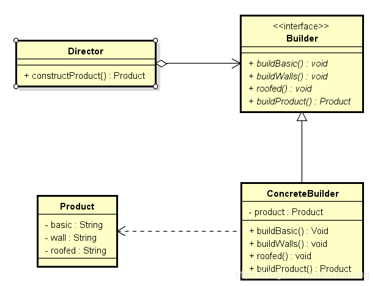
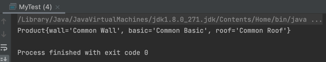

# 建造者模式



## 模拟思考
建造者类似过程：建造房子，房子材料属于产品，构造的子过程需要工人完成，
子过程的组合流程需要指挥者指挥，实现了产品与产品的构建过程的分离，隔离了复杂的构建过程。

## 代码演示
```java
// 房子构建流程接口
package com.zyx.builder;

public interface Builder {
    void buildBasic();
    void buildWall();
    void buildRoof();
    Product makeProduct();
}
```

```java
// 产品类 
package com.zyx.builder;

@Data
public class Product {
    private String wall;
    private String basic;
    private String roof;
}
```
```java
package com.zyx.builder;

// 产品的建造实际过程
public class CommonBuilder implements Builder{
    Product product = new Product();

    @Override
    public void buildBasic() {
        product.setBasic("Common Basic");
    }

    @Override
    public void buildWall() {
        product.setWall("Common Wall");
    }

    @Override
    public void buildRoof() {
        product.setRoof("Common Roof");
    }

    @Override
    public Product makeProduct() {
        return product;
    }
}
```
```java
// 指挥者
package com.zyx.builder;

public class Director {
    private Builder builder;

    public Director(Builder builder) {
        this.builder = builder;
    }

    public Product getProduct() {
        builder.buildBasic();
        builder.buildWall();
        builder.buildRoof();
        return builder.makeProduct();
    }
}
```
```java
// 测试类
package com.zyx.builder;

public class MyTest {
    public static void main(String[] args) {
        CommonBuilder commonBuilder = new CommonBuilder();
        Director director = new Director(commonBuilder);
        System.out.println(director.getProduct());
    }
}
```
Output:



## 建造者模式（Builder）优缺点
**优点**：
1. 产品的建造和表示分离，实现了解耦，可以使用相同创建过程得到不同的产品。 
2. 将复杂产品的创建步骤分解在不同的方法中，使得创建过程更加清晰。（良好的封装性，不必知道内部组成的细节） 
3. 增加新的具体建造者无需修改原有类库的代码，易于拓展，符合“开闭原则“。

**缺点**：
1. 产品必须有共同点，限制了使用范围。建造者模式创造出来的产品，其组成部分基本相同。如果产品之间的差异较大，则不适用这个模式。 
2. 产生多余的builder对象以及director对象，消耗内存。（如内部变化复杂，会有很多的建造类，难以维护）
