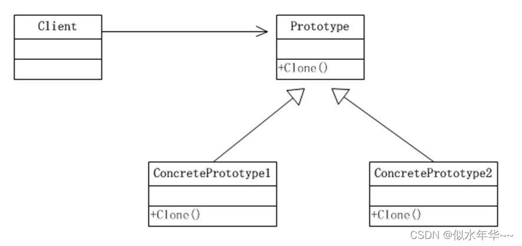
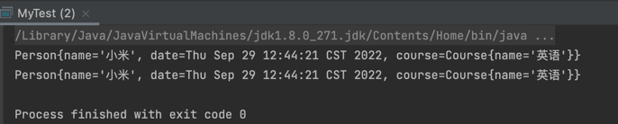

# 克隆模式
原型实例指定创建对象的种类，并且通过拷贝这些原型，创建新的对象


## 浅克隆
1. 基本数据类型 - 值传递
2. 引用数据类型 - 引用传递

```java
package com.zyx.prototype.shallow;

import java.util.Date;

// 具体的原型类
public class Person implements Cloneable{
    private String name;
    private Date date;
    private Course course;

    public Person() {
    }

    public Person(String name, Date date, Course course) {
        this.name = name;
        this.date = date;
        this.course = course;
    }

    public String getName() {
        return name;
    }

    public void setName(String name) {
        this.name = name;
    }

    public Date getDate() {
        return date;
    }

    public void setDate(Date date) {
        this.date = date;
    }

    public Course getCourse() {
        return course;
    }

    public void setCourse(Course course) {
        this.course = course;
    }

    @Override
    public String toString() {
        return "Person{" +
                "name='" + name + '\'' +
                ", date=" + date +
                ", course=" + course +
                '}';
    }

    @Override
    public Person clone() {
        try {
            Person person = (Person) super.clone();
            // TODO: copy mutable state here, so the clone can't change the internals of the original
            return person;
        } catch (CloneNotSupportedException e) {
            throw new AssertionError();
        }
    }
}
```
```java
// 测试类
package com.zyx.prototype.shallow;


import java.util.Date;

public class MyTest {
    public static void main(String[] args) {
        Date date = new Date();

        Course course = new Course("数学");
        Person person1 = new Person("小米",date,course);
        Person person3 = (Person) person1.clone();

        course.setName("英语");

        System.out.println(person1);
        System.out.println(person3);
    }
}
```
output：

## 深克隆
1. 基本数据类型 - 值传递
2. 引用数据类型 - 申请新的存储空间，A、B都同时指向各自的引用对象

### 重写 clone 方法来实现深拷贝
```java
// 原型类的clone方法
package com.zyx.prototype.deep;

import java.util.Date;

public class Person implements Cloneable{
    private String name;
    private Date date;
    private Course course;
    
    // 区别在于重写的clone方法
    @Override
    public Person clone() {
        try {
            Person person = (Person) super.clone();
            person.course = course.clone();
            // TODO: copy mutable state here, so the clone can't change the internals of the original
            return person;
        } catch (CloneNotSupportedException e) {
            throw new AssertionError();
        }
    }
}
```

```java
package com.zyx.prototype.deep;

public class Course implements Cloneable{
    private String name;
    // 引用对象需要实现clone接口，并且重写clone方法
    @Override
    public Course clone() {
        try {
            Course clone = (Course) super.clone();
            // TODO: copy mutable state here, so the clone can't change the internals of the original
            return clone;
        } catch (CloneNotSupportedException e) {
            throw new AssertionError();
        }
    }
}
```

**原型模式的注意事项和细节**

1. 创建新的对象比较复杂时，可以利用原型模式简化对象的创建过程，同时也能够提高效率 
2. 不用重新初始化对象，而是动态地获得对象运行时的状态 
3. 如果原始对象发生变化(增加或者减少属性)，其它克隆对象的也会发生相应的变化，无需修改代码 
4. 在实现深克隆的时候可能需要比较复杂的代码 
5. **缺点**：需要为每一个类配备一个克隆方法，这对全新的类来说不是很难，但对已有的类进行改造时，需要修改其源代码，违背了 ocp 原则。
